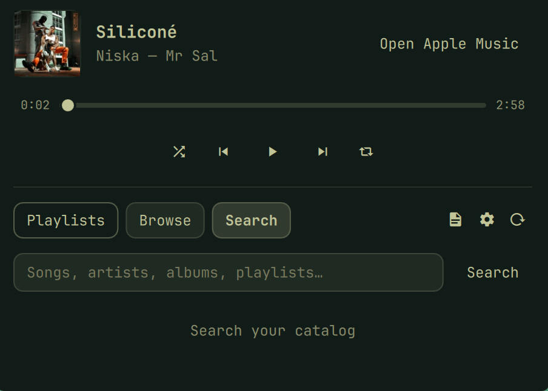

# Apple Music for Omarchy

Apple Music as an Omarchy bar widget: a player panel for the page you are signed in to — playlists, catalog browsing, and search — with the full `music.apple.com` site in a dedicated, theme-matched browser window of its own.

Built for **Firefox**, which it uses by default. Chromium is supported as an opt-in.



## Install

```bash
omarchy plugin add https://github.com/Akenoxz/apple-music-omarchy-firefox.git --enable
omarchy-pkg-add firefox     # if Firefox is not installed yet
```

Click the Apple Music mark on the bar, press **Open Apple Music**, and sign in once. The session lives in the plugin's own browser profile and survives restarts. Allow DRM when Apple Music asks: Firefox downloads Widevine on first use, and protected tracks play once that finishes.

Update with `omarchy plugin update akenoxz.apple-music`, then `omarchy-restart-shell` so the bar loads the new QML.

## Requirements

| | |
|---|---|
| Omarchy | 4 (Quattro) or newer, `omarchy-shell` on Hyprland |
| Firefox | the default browser mode — `omarchy-pkg-add firefox` |
| `jq` | already present on Omarchy |
| Node.js | optional; runs the page bridge behind the list tabs |

Node is what gives the panel playlists, browse, and search. Without it the panel still plays, pauses, and skips through the browser's MPRIS interface; the three list tabs stay empty and the seek bar stays inert — and the browser launches with remote debugging switched off, because the BiDi port would otherwise be opened for a bridge that cannot run (see Privacy).

Chromium mode additionally depends on Chromium's codec and DRM support: a build without a working Widevine CDM loads the site but refuses protected tracks.

## Browser modes

### Firefox — the default

Nothing to configure. On the first launch the plugin creates a profile at `$XDG_DATA_HOME/omarchy-apple-music/firefox/AppleMusic` and registers it as a single entry in `~/.mozilla/firefox/profiles.ini`. Your own Firefox profiles are never opened or modified, and if you already own a profile named `AppleMusic` the launch stops with an error instead of reusing it.

- DRM and Widevine are enabled up front; the default-browser and session-restore prompts are off
- `chrome/userChrome.css` hides the tab bar, the URL bar, and the navigation controls so the window reads as an app — delete that file to bring the full browser UI back in that window
- `chrome/userContent.css` repaints `music.apple.com` in the active Omarchy palette
- launched as `firefox -P AppleMusic --new-window https://music.apple.com`, with `MOZ_APP_REMOTINGNAME` giving the window the `akenoxz.apple-music` class Hyprland matches — so it runs alongside your normal Firefox session instead of becoming a tab in it. `--remote-debugging-port=62229` joins that command line only when Node is available for the bridge and the profile belongs to the user launching it (see Privacy); otherwise the window opens with no debugger at all.

Trade-offs:

- the page palette is baked when the window launches, so after switching Omarchy themes, close the window (`Ctrl+Q`) and reopen it
- no **Full** / **Queue** switch in the page — use Apple's own interface
- no audio visualizer
- bar metadata comes from Firefox's MPRIS and can be thinner than Chromium's

### Chromium — opt-in

```bash
DATA="${XDG_DATA_HOME:-$HOME/.local/share}/omarchy-apple-music"
mkdir -p "$DATA"
echo chromium >"$DATA/browser-mode"
```

Close the Apple Music window first, then click the widget again. Delete that marker file to return to Firefox. Switching modes needs no shell or compositor restart, and a missing Firefox falls back to Chromium on its own.

Chromium mode also loads the plugin's bundled extension into the app window, which adds:

- the **Full** / **Queue** switch — Apple's full interface, or a compact listening view
- live theme sync, applied while the page is open
- the audio visualizer: the app's own audio, reduced to 32 bands and drawn clipped inside the Omarchy wordmark

Its profile is `$XDG_DATA_HOME/omarchy-apple-music/chromium`, opened at a fixed 90% zoom so Apple's desktop layout fits the dropdown.

## Using it

| Input | Icon view (default) | Player view |
|---|---|---|
| Left click | Player panel | Play / pause |
| Right click | Player panel | Player panel |
| Middle click | Switch to Player view | Switch to Icon view |
| Scroll up / down | Previous / next track | Previous / next track |

Icon view is the music mark, which becomes three dancing bars while something is playing. Player view puts a play/pause glyph beside `title · artist`, scrolling the text when it does not fit a bar.

The panel stays open while you pick tracks, and the row you clicked stays highlighted along with whatever the page reports as playing. Only the bar mark, a click outside, or `Esc` closes it; clicking another window hides it without stopping playback, and **Open Apple Music** closes the panel and focuses the browser window.

- **Playlists** — your library playlists. Open one to list its songs; picking a song starts the playlist there and keeps going.
- The song list scrolls two rows per wheel notch (and per arrow key), so a long playlist is a few flicks rather than a hundred.
- **Browse** — recently added albums and Apple's top playlists.
- **Search** — artists, songs, albums, and playlists. **Artists** leads, and an artist row opens their profile with top songs and albums. Both the search results and an artist's discography show albums only, never singles.
- An album row — in Browse, in the search results, or on an artist's page — opens the album's track list instead of starting to play, so nothing begins until you pick a song. Picking one plays it in album order.
- The refresh button refetches the lists, and the current search term while Search is open.

**Keyboard:** `Up`/`Down` (or `j`/`k`) move through the rows, `Left`/`Right` (or `h`/`l`) change tabs, `Enter` plays the selection, `Space` plays or pauses, `s` jumps to search, `Esc` steps back one level (an album, artist or playlist view, then the panel itself), and `Tab` hands focus to the next bar panel. While the search field is focused the keyboard belongs to it.

## Settings

`display` chooses the bar presentation:

```bash
omarchy bar set akenoxz.apple-music display player   # or icon
```

`status`, `mini`, and `miniplayer` are accepted as older names for `player`. Middle-clicking the widget flips between the two.

That is the only setting the widget reads. If an earlier version of the plugin left `lyrics`, `lyricsFont`, `lyricsSize`, or `scrollSpeed` in the bar config, they are ignored.

## Commands

```bash
omarchy-shell apple-music status          # JSON: window, media, theme, spectrum
omarchy-shell apple-music open | show | hide | close | toggle
omarchy-shell apple-music playPause | next | previous
omarchy-shell apple-music refreshTheme
omarchy-shell apple-music ping
```

## Where things live

| Path | What |
|---|---|
| `…/omarchy-apple-music/firefox/AppleMusic` | the Firefox app profile |
| `…/omarchy-apple-music/chromium` | the Chromium app profile |
| `…/omarchy-apple-music/browser-mode` | Chromium opt-out marker |
| `…/omarchy-apple-music/bridge-commands` | bridge commands in flight, deleted once answered |
| `$XDG_RUNTIME_DIR/omarchy-apple-music/bridge/state.json` | the playback snapshot, on tmpfs |
| `$XDG_RUNTIME_DIR/omarchy-apple-music/extension` | the staged extension plus its theme and spectrum JSON |

`…` is `${XDG_DATA_HOME:-$HOME/.local/share}`.

## Privacy

- Apple credentials never cross the widget. The bar reads sanitized metadata — title, artist, album, artwork URL, duration, position, repeat, shuffle, queue — through the browser's own MPRIS interface.
- The panel reaches the page through `bridge.mjs`, a dependency-free Node process attached over WebDriver BiDi on `127.0.0.1:62229`. It carries catalog data (names, artists, artwork URLs) and playback commands; authorization tokens and credentials never cross it.
- Nothing you type reaches a process argument list. The panel hands each bridge command to `control.sh` on stdin, and the wrapper writes it to `…/bridge-commands` (a `0700` directory holding `0600` files) for the bridge to read — so a search term is never visible in `ps` or `/proc/<pid>/cmdline` to another local account while the command is in flight.
- The bridge's debugging endpoint — WebDriver BiDi on `127.0.0.1:62229` — carries no authentication, by Mozilla's design: whatever reaches a loopback debugging port drives the browser and can read the signed-in session's cookies. The plugin therefore only ever opens it when the bridge that uses it can run (Node installed) and the browser profile belongs to the user launching it; in the no-Node, MPRIS-only mode the browser starts with remote debugging off entirely — no port on the command line, and `devtools.debugger.remote-enabled = false` written into the profile. Loopback keeps other machines out but cannot tell local accounts apart, which is exactly why the port never exists outside those two conditions.
- The playback snapshot is rewritten every 400 ms to tmpfs, and queued commands are deleted the moment they are answered.
- The only service work is transient **user** units — `systemd-run --user` for the page bridge and for the browser window — so both end with your session. Nothing is installed system-wide, nothing runs as root, and `sudo` is never used.
- The visualizer (Chromium only) records the Apple Music app's own PipeWire stream, reduces it to 32 bands in memory, writes only the band levels, and discards the audio. It runs only while the dropdown is open and playback is active.
- The extension and the spectrum analyzer ship with the plugin; nothing is downloaded at runtime.

Three environment variables tune the bridge, all optional: `OMARCHY_APPLE_MUSIC_BRIDGE_PORT` (default `62229`), `OMARCHY_APPLE_MUSIC_BRIDGE_CONNECT_MS` (default `120000`, sized for a cold browser launch), and `OMARCHY_APPLE_MUSIC_BRIDGE_ATTEMPTS` (default `400` polls of 20 ms, about eight seconds per command).

## How it works

```text
bar widget ──▶ Service.qml ──▶ browser window (Firefox, or a Chromium app window)
     ▲               │                      │
     └── MPRIS ──────┘        theme palette + page-local MusicKit state
                     │
                     ├── bridge.mjs (WebDriver BiDi) ── lists, search, transport
                     └── PipeWire ── 32-band spectrum (Chromium only)
```

The browser window is parked on the Hyprland special workspace `special:akenoxz-apple-music`, so hiding the dropdown neither stops playback nor drops the session — showing it moves and focuses that same window at the current bar edge. The window rules come from `hypr/apple-music.lua`, installed at runtime and matching either the plugin's own class or Chromium's relabelled `…-music.apple.com__*`; your compositor configuration is never written to.

`bridge.mjs` runs as the transient user unit `omarchy-apple-music-bridge`. It publishes the playback snapshot as a file and `Service.qml` watches that file, so the bar follows playback without a process per update, and the bridge polls its command directory every 40 ms so clicks feel immediate. A bridge that dies is started again on the next command whenever the Apple Music window exists — and never when no window is open — and it re-binds itself after a page navigation, so a stalled bridge heals instead of leaving the panel stuck on "the page bridge did not answer".

## Remove

```bash
omarchy plugin remove akenoxz.apple-music
hyprctl reload     # drops the runtime-only window rule
```

Your Apple session is kept on purpose, so removing or updating the plugin never logs you out. To take the local state with it, delete `$XDG_DATA_HOME/omarchy-apple-music` and drop the leftover `AppleMusic` entry from `~/.mozilla/firefox/profiles.ini`.

## Tests

```bash
node --test tests/          # model, extension, player, panel, and bridge suites
tests/spectrum.test.sh      # a 1 kHz tone must land in its own band
tests/control.test.sh       # launch, browser modes, and the bridge protocol
tests/integration.sh        # manifests, bar markup, live shell state

OMARCHY_APPLE_MUSIC_E2E=1 tests/integration.sh   # opt-in live launch/hide/close
```

`tests/control.test.sh` exercises the real `control.sh` against mocked browsers and Hyprland. It covers both browser modes end to end: Firefox by default with no marker, the `chromium` marker overriding it, the fallback when Firefox is absent, refusing to touch a user-owned `AppleMusic` profile, registering that profile exactly once across relaunches, the generated `userContent.css`, the disabled spectrum path, and the debug endpoint — the port present when Node can run the bridge, absent with Node off PATH, and refused for a profile the launching user does not own. Its bridge tests run against a stub on a throwaway port, so a test can never attach to a live browser session. The opt-in end-to-end run pins Chromium so it never registers anything in your real Firefox profile registry, and it skips itself whenever an Apple Music window is already open.

## License

MIT.

Built by Thomas Laranjo.

Apple and Apple Music are trademarks of Apple Inc. This project is independent, and is not affiliated with or endorsed by Apple.
